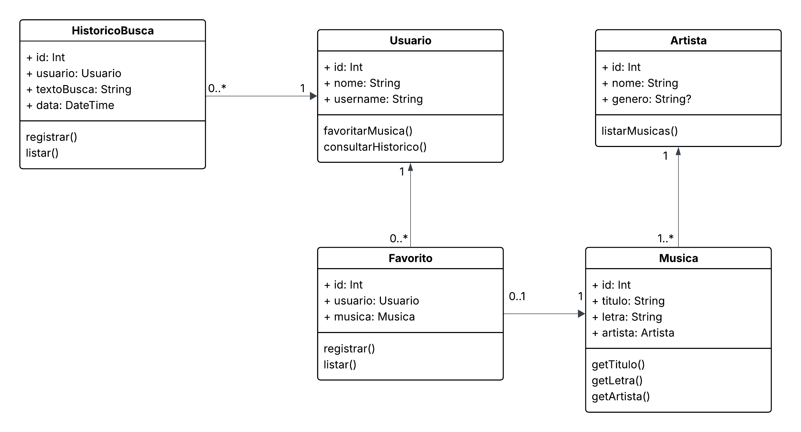

# Diagrama de Classes

O diagrama de classes abaixo representa a estrutura estática inicial do sistema **Liryx**, responsável por gerenciar usuários, músicas, artistas, favoritos e histórico de buscas.

---

## Descrição das Classes

### 1. **Usuario**

Representa o usuário do aplicativo.  

**Atributos**:  
  - `id: Int` — Identificador único.  
  - `nome: String` — Nome completo do usuário.  
  - `username: String` — Nome de usuário para login ou identificação.  

**Métodos**:  
  - `favoritarMusica()` — Permite ao usuário favoritar uma música.  
  - `consultarHistorico()` — Recupera o histórico de buscas realizadas.  

---

### 2. **Musica**

Representa uma música cadastrada no sistema.  

**Atributos**:  
  - `id: Int` — Identificador único.  
  - `titulo: String` — Título da música.  
  - `letra: String` — Letra completa da música.  
  - `artista: Artista` — Artista responsável pela música.  

**Métodos**:  
  - `getTitulo()` — Retorna o título da música.  
  - `getLetra()` — Retorna a letra da música.  
  - `getArtista()` — Retorna o artista da música.  

---

### 3. **Artista**

Representa um artista ou banda.  

**Atributos**:  
  - `id: Int` — Identificador único.  
  - `nome: String` — Nome do artista.  
  - `genero: String?` — Gênero musical (opcional).  

**Métodos**:  
  - `listarMusicas()` — Lista as músicas relacionadas a este artista.  

---

### 4. **Favorito**

Relaciona um usuário às músicas que ele marcou como favoritas.  

**Atributos**:  
  - `id: Int` — Identificador único.  
  - `usuario: Usuario` — Usuário que favoritou.  
  - `musica: Musica` — Música favoritada.  

**Métodos**:  
  - `registrar()` — Registra uma música como favorita.  
  - `listar()` — Lista as músicas favoritas do usuário.  

---

### 5. **HistoricoBusca**

Armazena o histórico de buscas realizadas por um usuário.  

**Atributos**:  
  - `id: Int` — Identificador único.  
  - `usuario: Usuario` — Usuário que realizou a busca.  
  - `textoBusca: String` — Texto que foi pesquisado.  
  - `data: DateTime` — Data e hora da busca.  

**Métodos**:  
  - `registrar()` — Registra uma nova busca no histórico.  
  - `listar()` — Lista as buscas realizadas.  

---

## Relacionamentos

- Um **Usuario** pode possuir múltiplos **Favoritos** e múltiplos **HistoricoBusca**.  
- Cada **Musica** está associada a um único **Artista**.  
- Um **Favorito** conecta um **Usuario** a uma **Musica**.  
- Um **HistoricoBusca** conecta um **Usuario** a um termo buscado.  

---

## Conclusão

Esse diagrama de classes define a **estrutura inicial** para o gerenciamento de músicas, artistas e interações dos usuários (favoritos e buscas). Ele serve de base para a implementação tanto do **backend (Ktor + PostgreSQL)** quanto do **app Android (Jetpack Compose + MVVM)**.
